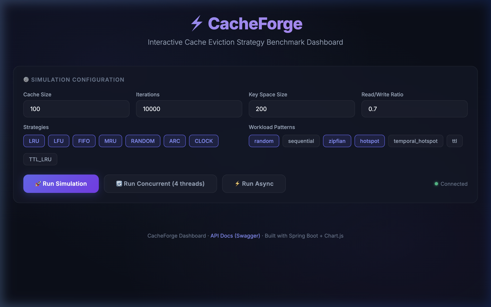

# CacheForge: Cache Simulation and Benchmarking Service

## Project Overview

CacheForge is a Spring Boot application for simulating and benchmarking cache replacement algorithms under configurable workload patterns. It provides a REST API and a simple web UI to run experiments, stream progress updates over WebSocket/STOMP, and compare results (hit rate, latency, evictions, etc.) between cache algorithms.

There is an online hosted demo you can try at: https://cache-forge.onrender.com

## Quick demo / screenshots

Open the live UI at https://cache-forge.onrender.com to try a simulation from your browser.




## Features

- Multiple cache algorithms implemented (see list below)
- Workload generators for a variety of realistic access patterns
- Latency tracking via a lightweight decorator (`LatencyTrackingCache`) so simulation-created caches measure operation latency without requiring Spring AOP
- Concurrent simulation mode with thread-safe cache wrappers (`ConcurrentCacheDecorator`)
- WebSocket/STOMP progress updates during simulations (topic: `/topic/simulation`)
- Configurable progress publish thresholds (percent-step and count-step) via properties
- Metrics exported via Micrometer (Gauges) — you can scrape these with Prometheus
- Simple REST API and Swagger UI for interactive exploration

## Implemented Cache Algorithms

- LRU (Least Recently Used)
- LFU (Least Frequently Used)
- FIFO (First-In, First-Out)
- MRU (Most Recently Used)
- Random (evict a random key)
- CLOCK (Second-chance approximation of LRU)
- ARC (Adaptive Replacement Cache)
- TTL_LRU (LRU with TTL implemented as a decorator)

Many of these are implemented using the same `Cache` interface and share the `Node` / `DoublyLinkedList` helper classes where appropriate.

## Workload Generators

- Random: uniform random key accesses
- Sequential: sequential range scans
- Zipfian: skewed, heavy-tail access distribution
- Hotspot: fixed hot set of keys receives most of the traffic
- Temporal Hotspot: hot set shifts over time
- TTL: exercise TTL expiry behavior with puts/gets on expiring keys

## Web UI & WebSocket

The front-end (`static/index.html`) connects using SockJS + STOMP to the server endpoint `/ws` and subscribes to `/topic/simulation`. Progress events are published as JSON objects with fields like:

{
  "progressPercent": 42,
  "strategy": "LRU",
  "pattern": "random",
  "status": "RUNNING",
  "iterationsCompleted": 42000,
  "totalIterations": 100000
}

The UI also sends POST requests to `/api/cache/benchmark/simulate` (and variants) to start simulations. A temporary debug endpoint is available for manual testing: `POST /api/debug/ws-test` which sends a sample event to `/topic/simulation`.

## How the simulator measures latency

Latency is measured in the `LatencyTrackingCache` decorator using `System.nanoTime()` around `get`, `put`, and `remove` operations. The decorator accumulates nanoseconds and `SimulatorService` converts to milliseconds when building JSON stats.

## Configuration

Default properties live in `src/main/resources/application.yml` or `application.properties`. Useful settings:

```yaml
# progress publishing thresholds
simulation:
  progress:
    percent-step: 5    # send every 5% progress
    count-step: 1000   # OR send every 1000 iterations
```

## API Reference (summary)

Base URL: `http://localhost:8080/api/cache/benchmark`

- POST `/simulate` — run simulations for provided `SimulationRequest` (accepts lists of strategies and workload patterns)
- POST `/simulate/all` — run all strategies × all patterns using shared `SimulationCommonParams`
- POST `/simulate/all-strategies?pattern=<pattern>` — run all strategies for a given pattern
- POST `/simulate/all-patterns?strategy=<strategy>` — run all patterns for a given strategy
- POST `/simulate/concurrent?threads=4` — run simulation concurrently across threads
- POST `/simulate/async` — run all runs asynchronously and return aggregated results when finished

There is also `POST /api/debug/ws-test` which emits a sample WebSocket simulation event for manual testing.

## Running locally

Prerequisites:
- Java 21+
- Maven

Build and run:
```bash
mvn clean package
mvn spring-boot:run
# or: java -jar target/cache-forge-0.0.1-SNAPSHOT.jar
```

Open your browser at `http://localhost:8080/` to view the UI and the Swagger playground.

## Notes / Architecture details

- The simulator constructs cache instances per run using `getCacheBasedOnStrategy(...)` and wraps them with `LatencyTrackingCache` so latency is measured for simulation-run objects (no need for caches to be Spring beans).
- `SimulatorService` publishes periodic progress updates to `/topic/simulation`. Defaults are 5% increments and every 1000 iterations; both are configurable.
- `ConcurrentCacheDecorator` provides a thread-safe wrapper used for concurrent simulations.

## Live demo

You can try a live demo at: https://cache-forge.onrender.com

## Contributing

Contributions are welcome. Please open issues and PRs with small, focused changes. Unit tests are present for most core components (cache implementations, workload generators, decorators), run them with `mvn test`.

---

